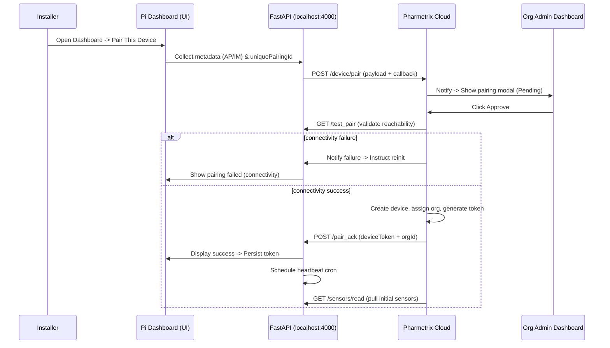

# Pharmetrix Device Pairing Specification

**Status:** Draft
>This Documentation and the pairing system is still under active development. Changes to the final apis or code is expected. Please do not rely on this documentation for production use.
---

## Overview

This document captures the full, end-to-end pairing lifecycle for Raspberry Pi–based Pharmetrix edge devices. It includes the UI flow, API contracts, state transitions, error handling, and a Mermaid sequence diagram illustrating the interactions between components.

> Principle: The Pi requests pairing; the organization/admin approves and the cloud binds the device to the org. The Pi never arbitrarily chooses its org.

---

## Actors

* **Installer** — field technician using the Pi dashboard
* **Pi Dashboard** — local UI served by FastAPI on the device (e.g., `http://<pi-ip>:<port>`)
* **FastAPI (Pi backend)** — local device backend (example `http://localhost:4000`)
* **Pharmetrix Cloud (Node backend)** — `https://pharmetrix.onrender.com`
* **Organization Admin** — admin user who approves pairing requests in the org dashboard

---

## Requirements & Constraints

* Pairing must be auditable and idempotent.
* Pairing codes (Unique Pairing ID / OrgPairCode) must be time-limited and single-use (configurable).
* AP = auto-populated; IM = immutable once captured.
* The Pi must persist a `pairingId` or `deviceId` and poll pairing status until activation or timeout.
* All network operations should be tolerant of NAT/local firewall edge cases; Cloud should support retries and backoff when contacting device callbacks.

---

## Device Pairing UI (Installer Flow)

1. Installer opens the Pi Dashboard.
2. Clicks **Pair This Device**.
3. Modal collects:

   * **Manual inputs**: `deviceName`, `location`, `heartbeatInterval`, `deviceVersion`, `uniquePairingId` (entered last).
   * **Auto-populated (ap)**: `publicIp` (ap, im), `macAddress` (ap, im), `port` (ap), `deviceId` (ap, im).
   * **Immutable (im)**: `publicIp`, `macAddress`, `deviceId` — cannot be edited by installer.
4. Installer submits the modal which triggers a pairing request to the cloud.

---

## API Contracts (minimum viable)

### 1) Device → Cloud: Create Pairing Request

`POST https://pharmetrix.onrender.com/device/pair`

**Request payload** (JSON):

```json
{
  "deviceId": "pi_0918",
  "deviceName": "FridgeCam-1",
  "location": "Fridge A - Shelf 2",
  "publicIp": "203.0.113.45",
  "macAddress": "AA:BB:CC:DD:EE:FF",
  "port": 4000,
  "heartbeatInterval": 300,
  "deviceVersion": "1.0.2",
  "uniquePairingId": "AB12-CD34-EF56",
  "callback": "http://192.168.1.64:4000"
}
```

**Cloud response (201 Accepted)**:

```json
{
  "pairingId": "pair_abc123",
  "status": "PENDING_ADMIN_APPROVAL",
  "expiresAt": "2025-11-21T12:00:00Z"
}
```

> Cloud stores the request as `PENDING_ADMIN_APPROVAL` and emits a real-time notification to the org admin.

---

### 2) Admin Approval Endpoint (Cloud)

`POST https://pharmetrix.onrender.com/orgs/{orgId}/pairings/{pairingId}/approve`

**Request payload**:

```json
{ "approvedBy": "admin_user_id" }
```

**Cloud behavior on approve**:

1. Validate pairing record & `uniquePairingId` (not expired / not used).
2. Attempt to validate connectivity to Pi by calling FastAPI:
   `GET http://<pi-ip>:4000/test_pair`

   * If this check fails, mark pairing `FAILED_CONNECTIVITY` and notify the installer / retry logic.
3. If connectivity check succeeds:

   * Create device record and assign `orgId`.
   * Generate device auth credentials (long-lived token / JWT / device certificate).
   * Mark pairing `ACTIVE`.
   * POST ack to the Pi callback endpoint: `POST http://<pi-ip>:4000/pair_ack`.

**Cloud approve response**:

```json
{ "status": "ACTIVATION_INITIATED" }
```

---

### 3) Cloud → Pi: Pairing Acknowledgement

`POST http://<pi-ip>:4000/pair_ack`

**Payload**:

```json
{
  "status": "approved",
  "deviceToken": "eyJhbGciOi...",
  "orgId": "org_77a",
  "deviceId": "pi_0918",
  "msg": "Device successfully paired with organization."
}
```

Pi should:

* Persist `deviceToken`, `orgId`, and `deviceId` to disk securely.
* Display success in the UI.
* Kick off the heartbeat scheduler.

### Pi Fallback Polling Loop (5s Interval)

After sending the initial POST `/device/pair`, the Pi MUST start a background
status-polling loop to ensure reliable pairing, even when the cloud cannot
perform a LAN callback due to NAT/firewalls.

**Pi → Cloud (every 5 seconds):**

`GET https://pharmetrix.onrender.com/device/pair/status?pairingId=<PAIRING_ID>`


**Cloud may return:**
- `PENDING_ADMIN_APPROVAL` → Admin hasn’t approved yet  
- `APPROVED_PENDING_CALLBACK` → Admin approved; cloud trying callback  
- `APPROVED_AWAITING_POLL` → Callback failed; Pi must finalize pairing  
- `ACTIVE` → Pairing completed  

---

### Pi Behavior on Poll Response
When Pi receives either:

- `ACTIVE`  
**or**
- `APPROVED_AWAITING_POLL`  

the Pi must immediately:

1. Persist `deviceToken`, `orgId`, `deviceId`  
2. Mark device status as `ACTIVE`  
3. Start heartbeat scheduler  
4. Start sensor/camera pipelines  
5. Update dashboard UI → “Pairing Successful”  
6. Stop polling loop  

This ensures the device pairs successfully **even when callback ACK cannot reach the Pi**, making the onboarding workflow firewall-proof and enterprise-safe.


---

### 4) Heartbeat (FastAPI → Cloud)

**Cron / Scheduler Behavior** (created on Pi after pairing acknowledgement):
`POST https://pharmetrix.onrender.com/device/still_alive/{deviceId}`

**Payload**:

```json
{
  "deviceId": "pi_0918",
  "timestamp": "2025-11-21T11:05:00Z",
  "status": "OK",
  "uptime": 3600
}
```

Cloud should validate token, update device lastSeen, and raise alerts if heartbeats stop.

---

### 5) Initial Sensor Pull (Cloud → Pi)

`GET http://<pi-ip>:4000/sensors/read`

**Expected response** (200 OK):

```json
{
  "temperature": 4.2,
  "humidity": 56,
  "timestamp": "2025-11-21T11:06:00Z"
}
```

Cloud stores the first sensor snapshot and verifies data path integrity.


---

## States & State Transitions

* `UNPAIRED` — device not yet registered
* `PENDING_ADMIN_APPROVAL` — cloud has a pending pairing request
* `FAILED_CONNECTIVITY` — cloud could not reach the device callback during approval
* `ACTIVE` — device bound to org and operational
* `REVOKED` — device deactivated by org admin or system

Transitions:

* `UNPAIRED` → `PENDING_ADMIN_APPROVAL` (on POST /device/pair)
* `PENDING_ADMIN_APPROVAL` → `FAILED_CONNECTIVITY` (on failed /test_pair)
* `PENDING_ADMIN_APPROVAL` → `ACTIVE` (on successful approve & connectivity)
* `ACTIVE` → `REVOKED` (on admin revoke)

---

## Error Handling & Edge Cases

1. **NAT / Local Firewall** — If cloud cannot initiate an HTTP callback to device, fallback strategies:

   * Use Pi-polling: Pi must poll `/device/pair/status?pairingId=` until activation.
   * Use reverse tunnel or persistent WebSocket connection from Pi to cloud (recommended for reliability).
2. **Pairing Code Replay** — Mark pairing codes single-use and rotate/expire.
3. **Race Conditions** — If two admins approve the same pairing, ensure idempotent activation and token issuance.
4. **Token Theft** — Ensure device tokens are tied to `deviceId` and rotated on-demand. Provide revoke endpoint.
5. **Long Offline Devices** — Use `createdAt + expiresWindow` for pairing requests and clean stale `PENDING` entries.

---

## Security Considerations

* All cloud endpoints must enforce TLS.
* Device tokens should be cryptographically strong; prefer short-lived tokens with refresh or a device certificate model.
* Sanitize and validate all AP/IM fields server-side (don’t trust client-supplied metadata).
* Log audit trail for approvals (`who`, `when`, `ip`, `pairingRequestId`).

---

## Sequence Diagram (Mermaid)



---

## Implementation Checklist

* [ ] Cloud: `/device/pair` endpoint + pending pairing store
* [ ] Cloud: Admin notifications + pairing approval UI
* [ ] Cloud: `/orgs/{orgId}/pairings/{pairingId}/approve` endpoint
* [ ] Cloud: Connectivity check `GET /test_pair` logic and backoff
* [ ] FastAPI: `POST /pair_ack` handler (persist token, secure storage)
* [ ] FastAPI: `GET /test_pair` handler (returns 200 + metadata)
* [ ] FastAPI: Heartbeat scheduler and `/sensors/read` implementation
* [ ] Security: TLS, token generation, revoke endpoint, auditing
* [ ] QA: End-to-end tests for happy + unhappy paths

---


*Document created by Prakhar Tripathi — pairing system (draft).*
