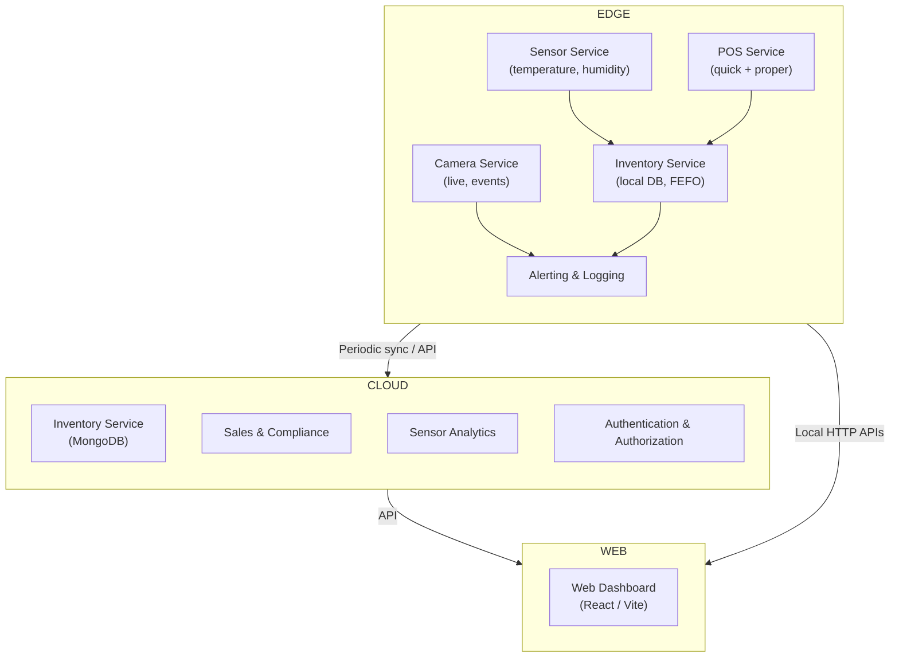

# Pharmetrix – Smart Pharmaceutical Inventory Management System

<p align="center">
  
</p>

<p align="center">
  <a href="#"></a>
  <a href="https://github.com/imprakhartripathi/Pharmetrix/actions"></a>
  <a href="LICENSE"></a>
  
</p>

**A Unified IoT + Cloud Platform for Modern Pharmacy Automation**

Pharmetrix is an end-to-end pharmaceutical inventory management ecosystem that bridges hardware and software. It brings automation, compliance, and real-time visibility to local pharmacies and nursing homes—at a fraction of enterprise costs.

---

## Table of Contents

1. [The Problem](#the-problem)
2. [What is Pharmetrix?](#what-is-pharmetrix)
3. [Why Pharmetrix? – Market Differentiation](#why-pharmetrix--market-differentiation)
4. [Unique Selling Points](#unique-selling-points)
5. [Key Features](#key-features)
6. [System Architecture](#system-architecture)
7. [Hardware Components](#hardware-components)
8. [Installation & Setup](#installation--setup)
9. [Usage](#usage)
10. [Legal Compliance & Safety](#legal-compliance--safety)
11. [Pricing & Deployment Cost](#pricing--deployment-cost)
<!-- 12. [Roadmap & Future Scope](#roadmap--future-scope) -->
12. [Development](#development)
13. [License](#license)

---

## The Problem

**The Reality in Indian Pharmacies Today:**

- **Manual Inventory**: Local pharmacies and nursing homes still rely on pen-and-paper systems or basic spreadsheets.
- **No Temperature Monitoring**: Refrigerated medicines are stored in fridges with no real-time monitoring of temperature or humidity.
- **Hidden Stock Errors**: Staff manually inspect shelves and trays to find medicines. Misplaced items lead to stockouts and lost revenue.
- **Regulatory Risks**: Expired medicines go unnoticed, creating compliance violations under the Drugs & Cosmetics Act.
- **Slow Customer Service**: Every sale requires manual searching and calculation—customers wait longer than necessary.
- **No Audit Trail**: When issues occur, there's no digital proof of proper handling, leading to compliance problems during audits.

**Result:** Stock losses, customer dissatisfaction, regulatory penalties, and operational inefficiency.

---

## What is Pharmetrix?

Pharmetrix is a **Pharmacy's Digital Twin**—a unified ecosystem that automates inventory, sales, storage monitoring, and compliance logging.

**Core Components:**

| Component | Purpose |
|-----------|---------|
| **Inventory Dashboard** | Real-time stock visibility, batch tracking (FEFO), expiry management. |
| **Dual-Mode POS System** | Quick Sale (fast OTC) or Proper Sale (full compliance). |
| **Temperature & Humidity Sensors** | Dual sensors monitor fridge (2–8°C) and ambient conditions 24/7. |
| **Camera Feed** | Remote visual verification of storage conditions and alert scenarios. |
| **Edge Device** | Raspberry Pi processes sensors and camera locally—no cloud dependency. |
| **Cloud Dashboard** | Periodic sync for analytics, backup, and compliance reporting. |
| **Alerting Engine** | Automated SMS/email notifications for temperature violations, low stock, expiry alerts. |
| **Audit Logs** | Complete digital trail: every sale, sensor reading, and operator action. |

---

## Why Pharmetrix? – Market Differentiation

### The Market Gap

**Software-Only Systems** (e.g., traditional POS or inventory management):
- Manage sales and stock brilliantly
- **Missing:** No cold-chain monitoring, no physical verification capability
- Result: Temperature-sensitive medicines stored in unmonitored fridges

**IoT Cold-Chain Solutions** (e.g., temperature monitoring platforms):
- Excellent at monitoring storage conditions
- **Missing:** No integrated POS, no batch management, no sales workflow
- Result: Great data but disconnected from actual pharmacy operations

**Pharmetrix Combines Both:**
- ✅ Real-time inventory + sales workflow (POS)
- ✅ Cold-chain monitoring + camera verification
- ✅ Batch-level management (FEFO) + expiry alerts
- ✅ Unified dashboard, unified logic, one ecosystem
- ✅ Local + cloud hybrid architecture

### Cost Advantage

| Aspect | Pharmetrix | Market Competitors |
|--------|-----------|-------------------|
| **Hardware Cost** | ₹10,000–20,000 | ₹80,000–1.5 lakh |
| **Software** | Open-source + cloud | Proprietary SaaS |
| **Deployment Time** | Days | Weeks/Months |
| **Scalability** | Per-pharmacy | Enterprise-only |
| **Customization** | Full (open-source) | Limited |

**Pharmetrix is 80–90% cheaper while delivering enterprise-grade automation.**

---

## Unique Selling Points

### A. Integrated Hardware–Software Stack (RARE IN MARKET)

Most solutions force you to choose: inventory software OR cold-chain monitoring. Pharmetrix unifies both.

**What You Get:**
- One dashboard for stock, sales, and storage conditions
- Automated alerts link temperature anomalies to affected batches
- Historical correlation: "This batch was stored at 12°C for 3 hours—do not sell"
- Full traceability: who sold what, from which batch, at what time

### B. Dual Sales Mode: Quick vs Proper

**Quick Sale Mode** (Optimized for speed):
- Ideal for OTC medicines, repeat customers, high-volume sales
- Tablet-based interface: select medicine → enter quantity → instant price
- No bill generation required
- Perfect for pharmacy counters during rush hours
- Logs automatically to backend (time, qty, batch, operator ID)

**Proper Sale Mode** (Full compliance):
- For scheduled, restricted, or prescription medicines
- Packet-wise selection + customer details capture
- Full bill generation (printable or SMS receipt)
- Stores prescription on file for future Quick Sales
- Supports audit and GST compliance

### C. Prescription-Linked Quick Sale (Legal & Smart)

**The Innovation:**
1. Customer uploads prescription once (stored in system)
2. System automatically verifies prescription validity period
3. On refill: customer enters phone number → checks prescription validity → dispenses via Quick Sale
4. Ensures **Drugs & Cosmetics Act compliance** while maintaining speed

**Legal Note:** Complies with Schedule X restrictions and Rx vs OTC rules.

### D. Dual Temperature Sensors – Complete Thermal Visibility

**Sensor Architecture:**
- **Sensor 1** (Inside Fridge): Continuous 2–8°C monitoring for refrigerated medicines
- **Sensor 2** (Ambient): Outside fridge to detect unsafe ambient conditions and heat exposure risks

**Why It Matters:**
- Detects cooling failures instantly
- Prevents room temperature exposure during power cuts
- WHO/CDC-compatible storage condition verification
- Automatic batch quarantine if temperature thresholds violated

### E. Camera (Future-Ready, Even Without CV Now)

**Today:**
- Live feed accessible from dashboard
- Remote visual verification: confirm open fridge doors, misplaced boxes, alert scenarios
- Evidence for regulatory audits

**Tomorrow:**
- On-device object detection (vial counting, package identification)
- Anomaly detection (unusual stocking patterns)
- No cloud inference needed—Coral TPU or Jetson Nano runs models locally

### F. Edge + Cloud Hybrid Architecture

**Edge Processing (Raspberry Pi):**
- Sensor data collection and processing
- Camera feed streaming
- Local alerting (buzzer, LED)
- Works even during internet outages

**Cloud Processing:**
- Periodic sync of inventory, sales, and sensor logs
- Historical analytics and trend analysis
- Backup and disaster recovery
- Compliance reporting (GST, audit trails)

**Benefit:** No full-time cloud dependency; you own your data locally.

### G. Future-Ready Hardware Architecture

**Prototyping:** Raspberry Pi 4 (current setup)

**Production Roadmap:**
- **Raspberry Pi Zero / Compute Module**: Lightweight, low-power
- **Coral TPU** or **Jetson Nano**: On-device ML for:
  - Temperature anomaly prediction (early failure detection)
  - Simple CV models (vial counting, package sorting)
  - No cloud inferencing needed

**Result:** Scalable, modular, and ready for AI-driven automation.

### H. Extremely Low Deployment Cost

**Pharmetrix Hardware Stack:**
- Raspberry Pi 4 (B model): ₹4,500
- Temperature/Humidity Sensors (2×): ₹1,500
- Camera Module: ₹1,500
- Network, Power, Housing: ₹2,500
- **Total: ₹10,000–20,000 per pharmacy**

**Market Alternatives:**
- Enterprise IoT platforms: ₹1,00,000+
- Cold-chain solutions: ₹80,000–1.5 lakh
- Custom integrations: ₹2+ lakh

**Pharmetrix is 80–90% cheaper.**

---

## Key Features

### 1. Inventory Management
- **Real-time Stock Tracking**: Add, remove, or adjust stock with live updates
- **Batch Management**: Track medicine batch number, manufacturing date, expiry date
- **FEFO Logic**: First Expire, First Out—system prioritizes older batches in sales
- **Expiry Alerts**: Automatic warnings for batches near expiry
- **Stock Reconciliation**: Physical count vs digital inventory

### 2. Batch-Level Management
- **Batch History**: Every batch has a complete lifecycle (received → stocked → sold → expiry)
- **FEFO Enforcement**: POS system prevents selling newer batches before older ones
- **Batch Quarantine**: Automatically mark batches as unsafe if storage conditions violated
- **Traceability**: Link each sale to a specific batch for recalls or compliance checks

### 3. Dual-Mode POS System
- **Quick Sale**: Tablet-based, fast checkouts for OTC items
- **Proper Sale**: Full billing, customer details, receipt generation
- **Prescription Linking**: Store once, reuse for Quick Sale refills
- **Digital Receipt**: Print, SMS, or QR code

### 4. Real-Time Sensor Monitoring
- **Temperature Tracking**: Fridge (2–8°C) and ambient readings
- **Humidity Monitoring**: Optional, for sensitive medicines
- **Threshold Alerts**: Automatic SMS/email if temp exceeds limits
- **Live Dashboard**: Historical graphs, trend analysis
- **Failover Alerts**: Detects cooling failures, power cuts, unusual conditions

### 5. Camera Integration
- **Live Feed**: Dashboard access to fridge interior camera
- **Event Triggers**: Records video during temperature alerts or door-open events
- **Cloud Backup**: Optional upload of critical events
- **Future CV Ready**: Framework in place for vial counting or anomaly detection

### 6. Automated Alerting Engine
- **Multi-Channel**: SMS, email, in-app notifications
- **Smart Triggers**: Temperature violations, low stock, expiry alerts, sensor failures
- **Escalation**: Critical alerts → SMS + email; minor alerts → app only
- **Audit Log**: Every alert and its resolution logged for compliance

### 7. Comprehensive Audit Logs
- **Every Action Logged**: Sales, stock adjustments, temperature readings, login/logout
- **Operator Tracking**: Who did what, when, and from where
- **GST Compliance**: Daily summary of sales, quantities, taxes
- **Regulatory Proof**: Complete digital trail for audits, recalls, or investigations

### 8. Local + Cloud Sync
- **Edge-First**: All data stored locally on Raspberry Pi
- **Periodic Sync**: Upload to cloud at defined intervals (hourly, daily)
- **Offline Resilience**: Works without internet; syncs when connection restored
- **Backup**: Cloud copy for disaster recovery and compliance reporting

### 9. Role-Based Access
- **Pharmacy Owner**: Full visibility, settings, reporting
- **Sales Staff**: POS access, limited inventory view
- **Pharmacist**: Inventory, compliance, alerts, approvals
- **Admin**: System configuration, user management

---

## System Architecture

Below is a more concise, modern diagram and a short textual breakdown of the major components. The diagram uses Mermaid (supported by many Markdown renderers). If your viewer doesn't render Mermaid diagrams, the plain-text summary that follows provides the same information.



Plain-text summary (fallback):

- **Edge / Pharmacy Location (Raspberry Pi)**: Collects sensor data (fridge + ambient), records local inventory, streams camera feed, and runs the POS (Quick + Proper). Stores audits locally and queues syncs to cloud.
- **Cloud Backend (Primary Node)**: Centralized services — Inventory (MongoDB), Sales & Compliance, Sensor Analytics, and Auth (JWT + RBAC). Receives periodic syncs from edge nodes and serves the web dashboard.
- **Web Dashboard (React / Vite)**: Multi-pharmacy view, reporting, analytics, compliance exports, and user management. Communicates with the cloud backend and (when on-trusted LAN) with edge APIs.

Design notes:

- Mermaid provides a compact diagram that renders in many markdown viewers and keeps the README readable.
- The plain-text fallback ensures the architecture is clear in any environment (including raw git hosts that don't render diagrams).
- If you'd like a different diagram flavor (sequence diagram, component boxes, or an SVG image), tell me which style and I can replace the Mermaid block.

---

## Hardware Components

### Recommended Setup

| Component | Model | Specification | Cost |
|-----------|-------|---------------|----|
| **Computing** | Raspberry Pi 4 (B, 4GB RAM) | ARMv7, WiFi, Ethernet | ₹4,500 |
| **Temperature Sensor 1** | DHT22 / BME680 | ±0.5°C accuracy, 0–50°C range | ₹800 |
| **Temperature Sensor 2** | DHT22 / DHT11 | ±2°C accuracy, 0–50°C range | ₹400 |
| **Humidity Sensor** | BME680 (optional) | Built-in humidity | Included |
| **Camera** | Pi Camera V2 / V3 | 8MP, low-light capable | ₹1,500 |
| **Power Supply** | 5V 3A USB-C | Stable power, backup recommended | ₹1,000 |
| **Networking** | PoE or WiFi 6 Adapter | Stable connectivity | ₹500 |
| **Housing & Cooling** | Aluminum Case + Fan | Thermal management, IP65 optional | ₹500 |
| **Installation & Misc.** | Cables, Brackets, Connectors | — | ₹800 |
| **TOTAL** | — | — | **₹10,000–15,000** |

### Production Roadmap

**Future Optimizations:**
- **Raspberry Pi Zero + Compute Module**: Lower cost, similar performance
- **Coral TPU**: On-device ML inference (temperature prediction, anomaly detection)
- **Jetson Nano**: More powerful edge computing for advanced CV
- **Industrial IoT Gateway**: Multi-sensor hub with redundancy

---

## Installation & Setup

### Prerequisites

- Raspberry Pi 4B (4GB+ RAM recommended)
- Sensors and camera connected to GPIO/CSI ports
- WiFi or Ethernet connectivity
- Docker installed (recommended for containerized services)
- Node.js 16+ for backend services
- PostgreSQL or MongoDB for database

### Quick Start (Docker Compose)

```bash
# Clone the repository
git clone https://github.com/imprakhartripathi/Pharmetrix.git
cd Pharmetrix

# Configure environment variables
cp .env.example .env
# Edit .env with your settings:
# - Database credentials
# - API endpoints
# - Sensor GPIO pins
# - Cloud sync interval

# Start services
docker-compose up -d

# Verify services
docker-compose ps
```

### Manual Setup (Development)

**1. Edge Device (Raspberry Pi)**

```bash
# SSH into Raspberry Pi
ssh pi@raspberrypi.local

# Install dependencies
sudo apt update && sudo apt install python3-pip python3-dev libatlas-base-dev libjasper-dev
pip3 install -r servers/edge-py/requirements.txt

# Start edge server
cd servers/edge-py
python3 -m src.server
```

**2. Primary Backend (Node.js)**

```bash
cd servers/primary-node
npm install
npm run build
npm start
```

**3. Streaming Server (Node.js)**

```bash
cd servers/streaming-node
npm install
npm start
```

**4. Frontend (React)**

```bash
cd clients/react
npm install
npm run dev
```

### Configuration

**Key Environment Variables:**

```
# Edge Device (Raspberry Pi)
SENSOR_TEMP_PIN=17
SENSOR_HUMIDITY_PIN=27
CAMERA_RESOLUTION=1920x1080
MQTT_BROKER=localhost:1883

# Backend
PRIMARY_BACKEND_PORT=4200
MONGODB_URI=mongodb://localhost:27017/pharmetrix
JWT_SECRET=your-secret-key

# Frontend
PRIMARY_BACKEND_URL=http://localhost:4200
STREAMING_SERVER_URL=ws://localhost:5000
```

---

## Usage

### For Pharmacy Staff

**Quick Sale (OTC Medicines):**
1. Open POS tablet
2. Tap "Quick Sale"
3. Search/scan medicine barcode
4. Enter quantity (tablet-wise)
5. Price auto-calculates
6. Tap "Complete Sale"
7. System logs the transaction

**Proper Sale (Prescribed Medicines):**
1. Open POS tablet
2. Tap "Proper Sale"
3. Enter customer name/phone
4. Select medicine (packet-wise)
5. Upload prescription (if new customer)
6. System validates prescription validity
7. Print/SMS receipt

### For Pharmacy Owner/Manager

**Monitor Inventory:**
1. Login to dashboard
2. View real-time stock levels
3. Track FEFO compliance (oldest batches prioritized)
4. Receive expiry alerts (auto-generated)

**Monitor Storage Conditions:**
1. View live sensor data (fridge + ambient temp/humidity)
2. Check historical graphs (temperature trends over time)
3. Review alert logs (violations and resolutions)
4. Camera feed available for visual verification

**Compliance & Reporting:**
1. Generate daily/weekly/monthly sales reports
2. Export GST-compliant transaction logs
3. Review audit trails (who sold what, when)
4. Download incident reports (temperature violations, recalls)

---

## Legal Compliance & Safety

### Regulatory Compliance (India)

**Drugs & Cosmetics Act, 1940:**
- ✅ Pharmetrix maintains digital records of all sales (Quick + Proper)
- ✅ Prescription validation before Rx dispensing
- ✅ Schedule X medicines blocked from Quick Sale entirely
- ✅ Complete audit trail for regulatory inspections

**Schedule X Medicines:**
Banned from Quick Sale. Requires:
- Pharmacist approval
- Customer ID verification
- Proper Sale workflow (full bill + prescription on file)

**Schedule H & H1 (Restricted):**
- Can use Quick Sale **only if** prescription is on file and validity verified
- Default: Route through Proper Sale for new customers

**Schedule Y (Expensive / Experimental):**
- Proper Sale only
- Additional verification steps
- Pharmacist sign-off

**GST Compliance:**
- All transactions logged with timestamp, quantity, price, batch
- Daily summary available for GST return filing
- HSN codes and tax rates auto-populated
- Audit-ready format (CSV/PDF export)

### Safety & Security

**Data Security:**
- ✅ All data encrypted in transit (HTTPS/TLS)
- ✅ At-rest encryption for sensitive fields (customer info, prescriptions)
- ✅ Role-based access control (RBAC)
- ✅ Login audit logs (who, when, from where)

**Physical Security:**
- Temperature sensors detect tampering or physical damage
- Camera feed records access to storage area
- Backup storage ensures data survives hardware failure

**Operational Safety:**
- ✅ Dual sensors prevent single-point-of-failure for temperature monitoring
- ✅ Automatic alerts if sensor becomes unresponsive
- ✅ Fallback to manual alerts if network unavailable
- ✅ Local data storage ensures no cloud dependency

### Liability & Compliance Notes

⚠️ **Disclaimer:**
- Pharmetrix is a tool to *assist* with compliance, not a substitute for pharmacy staff expertise.
- Final responsibility for medicine dispensing rests with the pharmacist.
- All Rx medicines must be verified by a qualified pharmacist before sale.
- System alerts are notifications—manual verification still required.
- Regular system audits recommended quarterly.

---

## Pricing & Deployment Cost

### Hardware Cost Breakdown

| Item | Cost |
|------|------|
| Raspberry Pi 4B (4GB) | ₹4,500 |
| Sensors (2× Temp + optional Humidity) | ₹1,200 |
| Camera Module | ₹1,500 |
| Power, Networking, Housing | ₹2,000 |
| Installation & Setup | ₹1,000 |
| **Total** | **₹10,200–15,000** |

### Software & Cloud Costs

| Service | Model | Cost |
|---------|-------|------|
| **Edge Software** | Open-source | Free |
| **Backend Server** | Hosted (AWS/Render) | ₹2,000–5,000/month (or self-hosted) |
| **Cloud Storage** | 100GB/month | ₹500–1,000/month (or local-only) |
| **SMS/Email** | 100 alerts/month | ₹500–1,000/month (or self-managed) |
| **Support** | Optional | ₹500–2,000/month |
| **TOTAL (Monthly, Optional)** | — | **₹0–10,000/month** |

### Comparison with Market

| System | Hardware | Software (Monthly) | Total First Year |
|--------|----------|-------------------|-----------------|
| **Pharmetrix** | ₹15,000 | ₹0–5,000 | ₹15,000–75,000 |
| **Competitors A** | ₹80,000 | ₹10,000 | ₹80,000–200,000 |
| **Competitors B** | ₹1,50,000 | ₹5,000 | ₹1,50,000–210,000 |

**Savings: 80–90% cheaper than market alternatives.**

---

<!-- ## Roadmap & Future Scope

### Q1 2025
- ✅ Core POS (Quick + Proper Sales)
- ✅ Batch management (FEFO)
- ✅ Temperature monitoring
- [ ] Mobile app for field staff

### Q2 2025
- [ ] Prescription-linked Quick Sale (full legal validation)
- [ ] Advanced analytics (temperature trend prediction)
- [ ] Multi-pharmacy dashboard aggregation
- [ ] Integration with popular POS systems

### Q3 2025
- [ ] On-device CV (vial counting, package detection)
- [ ] Coral TPU support for ML inference
- [ ] Jetson Nano deployment option
- [ ] Export to FHIR (healthcare data standard)

### Q4 2025 & Beyond
- [ ] AI-driven demand forecasting
- [ ] Automated batch reordering
- [ ] Integration with wholesale suppliers' APIs
- [ ] Support for multiple warehouses per pharmacy
- [ ] Advanced anomaly detection (unusual stock movements, theft detection)
- [ ] Blockchain-based audit trail (for highly regulated facilities)
- [ ] Integration with government regulatory databases (for recalls)

--- -->

## Development

### Project Structure

```
Pharmetrix/
├── clients/
│   ├── react/          # Main dashboard & POS (Vite)
│   ├── angular/        # Alternative frontend (optional)
│   └── mobile/         # Mobile app (future)
├── servers/
│   ├── primary-node/   # Inventory, Auth, Core APIs (Node.js/TypeScript)
│   ├── streaming-node/ # WebRTC/RTMP streaming server
│   ├── edge-py/        # Sensor + Camera (Python, runs on Raspberry Pi)
│   └── legacy/         # Previous versions (archived)
├── docker-compose.yml  # Full stack orchestration
├── setup.sh / setup.ps1 # Initial setup scripts
├── runner.sh / runner.ps1 # Development runner scripts
└── README.md           # This file
```

### Tech Stack

| Layer | Technology |
|-------|------------|
| **Frontend** | React 18, Vite, TypeScript, Framer Motion, SCSS |
| **Backend** | Node.js, Express, TypeScript, MongoDB, JWT |
| **Edge** | Python 3, FastAPI, MQTT, RPi GPIO |
| **Streaming** | WebRTC / RTMP (Node.js) |
| **Deployment** | Docker, Docker Compose |
| **Database** | MongoDB (cloud), SQLite (edge local) |
| **Authentication** | JWT + Email OTP |

### Contributing

1. Fork the repository
2. Create a feature branch (`git checkout -b feature/your-feature`)
3. Commit changes (`git commit -m "Add your feature"`)
4. Push to branch (`git push origin feature/your-feature`)
5. Create a Pull Request

### Running Tests

```bash
# Backend tests
cd servers/primary-node
npm test

# Frontend tests
cd clients/react
npm test

# Edge tests
cd servers/edge-py
pytest
```

### Troubleshooting

**Edge Device Won't Connect to Backend:**
- Check network connectivity: `ping backend-ip`
- Verify MQTT broker running: `docker-compose logs mqtt`
- Check edge logs: `docker-compose logs edge-py`

**Dashboard Not Updating:**
- Verify sync interval in `.env`
- Check MongoDB connection: `docker-compose logs mongo`
- Restart primary-node: `docker-compose restart primary-node`

**Sensor Data Not Reading:**
- Verify GPIO pins configured correctly
- Test sensor directly: `python3 -c "import board; print(board.D17)"`
- Check I2C address: `i2cdetect -y 1`

---

## License

MIT License – See LICENSE file for full terms.

Pharmetrix is open-source and free to use, modify, and distribute. Attribution appreciated.

---

## Credits

**Created by:** Prakhar Tripathi  
**Final Year Project (FYP)** – Smart Pharmaceutical Inventory Management System

For questions, issues, or feature requests: [Contact / Issues](https://github.com/imprakhartripathi/Pharmetrix/issues)

---

## Version

**Current:** v1.0.0 (Beta)  
**Last Updated:** November 15, 2025
